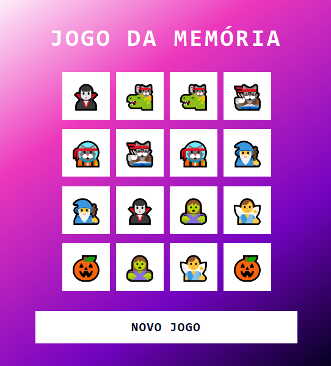

# Jogo da Memória

## Descrição
O Jogo da Memória é um jogo simples onde o jogador precisa encontrar pares de emojis em um tabuleiro. Cada emoji aparece duas vezes, e o jogador precisa combinar todas as peças para vencer o jogo.

## Imagens

## Tecnologias Utilizadas
- HTML5
- CSS3
- JavaScript

## Como Foi Construído
Este jogo foi construído principalmente com HTML, CSS e JavaScript. Aqui está uma visão geral de como cada tecnologia foi utilizada:

- **HTML5**: A estrutura básica da página web, incluindo a definição do tabuleiro do jogo e dos elementos HTML necessários para interação do usuário.

- **CSS3**: Estilização do jogo para torná-lo visualmente atraente e responsivo em diferentes dispositivos e tamanhos de tela. Utilizamos técnicas de flexbox e gradientes para o layout e aparência do jogo.

- **JavaScript**: Responsável pela lógica do jogo. Utilizamos JavaScript para embaralhar os emojis, lidar com os eventos de clique nas caixas, verificar se as caixas selecionadas correspondem e determinar quando o jogo é concluído.

## Como Jogar
1. Abra o arquivo `index.html` em seu navegador.
2. Clique em qualquer caixa para revelar o emoji oculto.
3. Clique em outra caixa para tentar encontrar o par do emoji revelado.
4. Continue até encontrar todos os pares de emojis.

## Como Contribuir
Se você gostaria de contribuir para este projeto, siga estas etapas:

1. Faça um fork do repositório.
2. Crie uma branch para sua contribuição (`git checkout -b minha-contribuicao`).
3. Faça suas alterações e commit (`git commit -am 'Adicionei uma nova funcionalidade'`).
4. Faça um push para a branch (`git push origin minha-contribuicao`).
5. Abra um Pull Request.

---